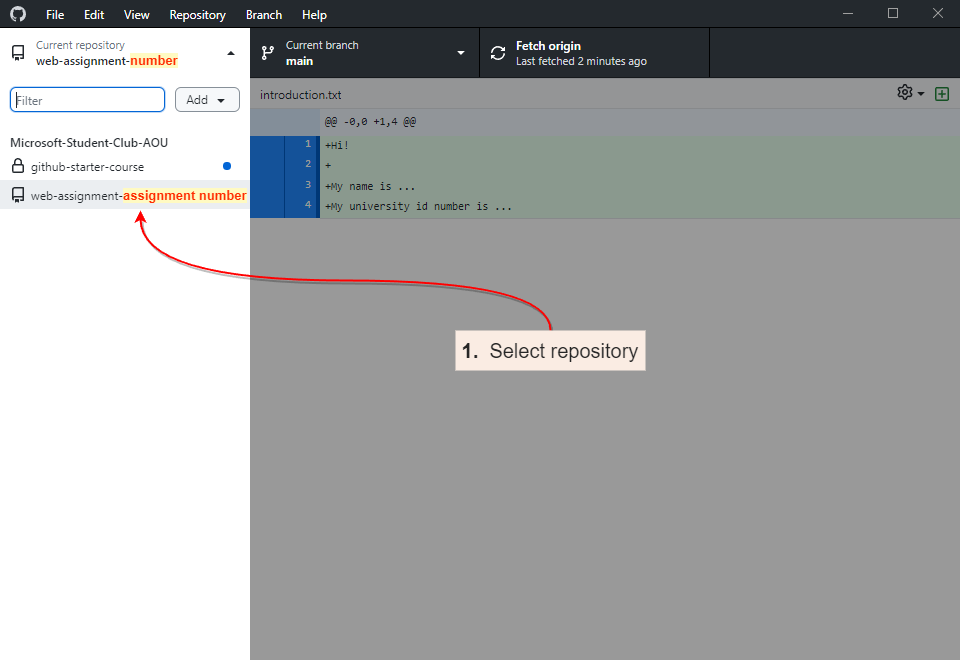
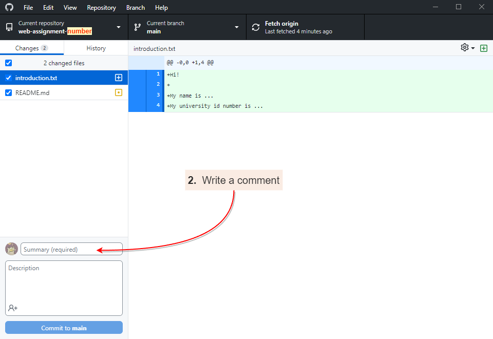
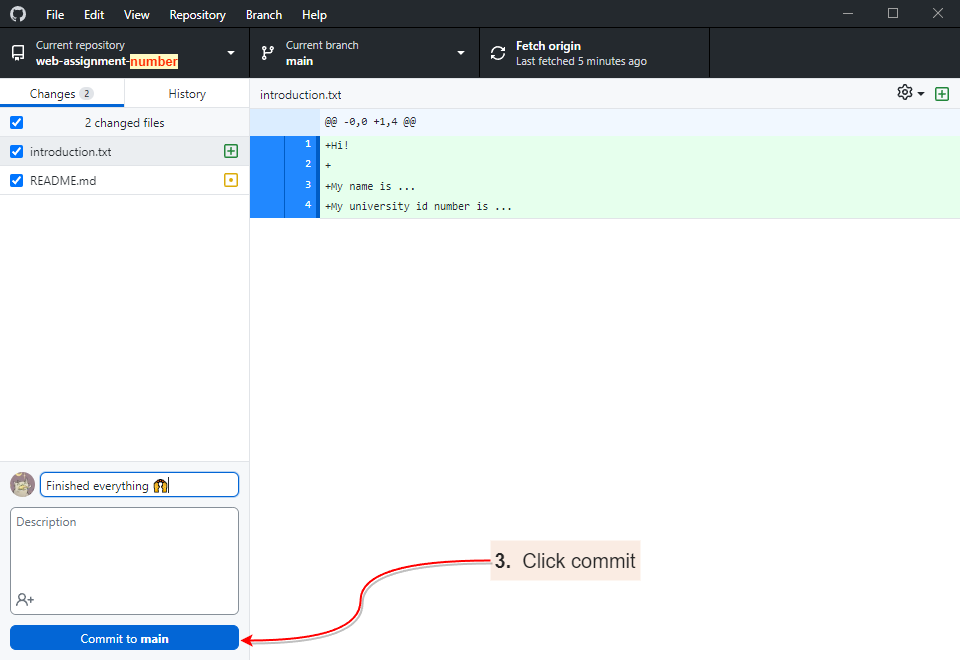
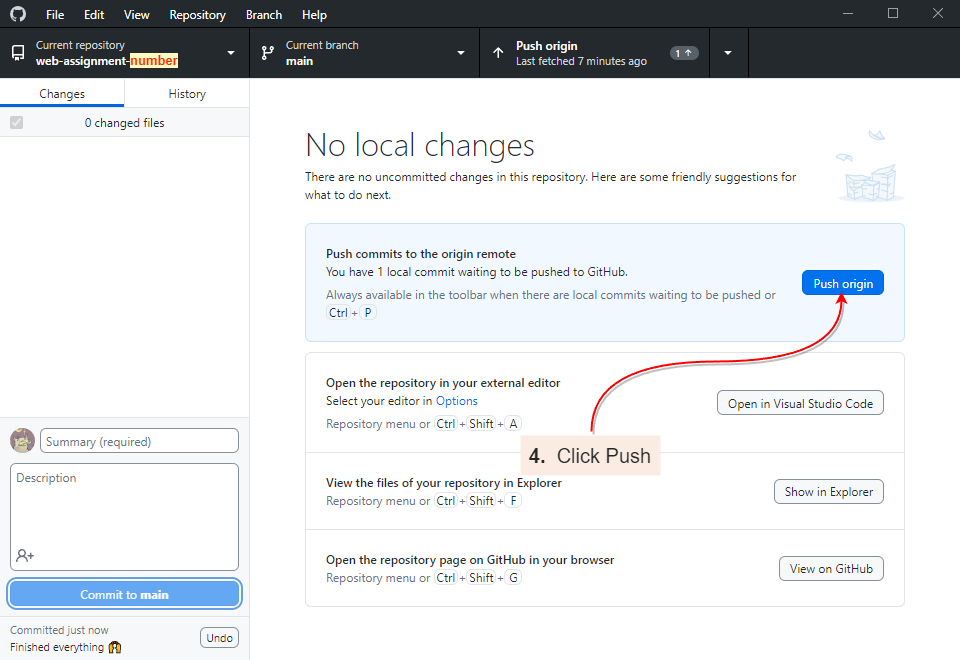
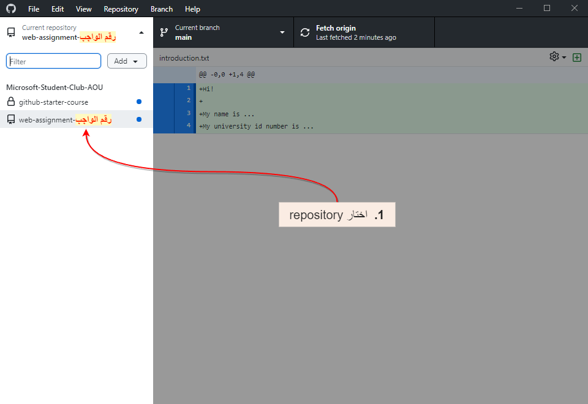
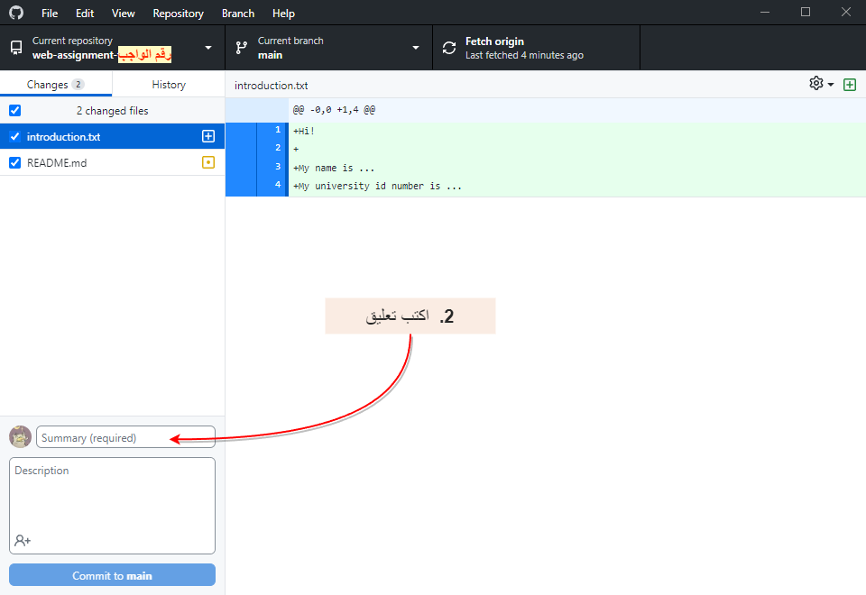
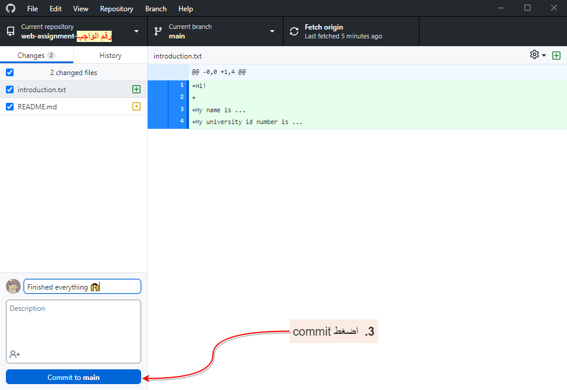
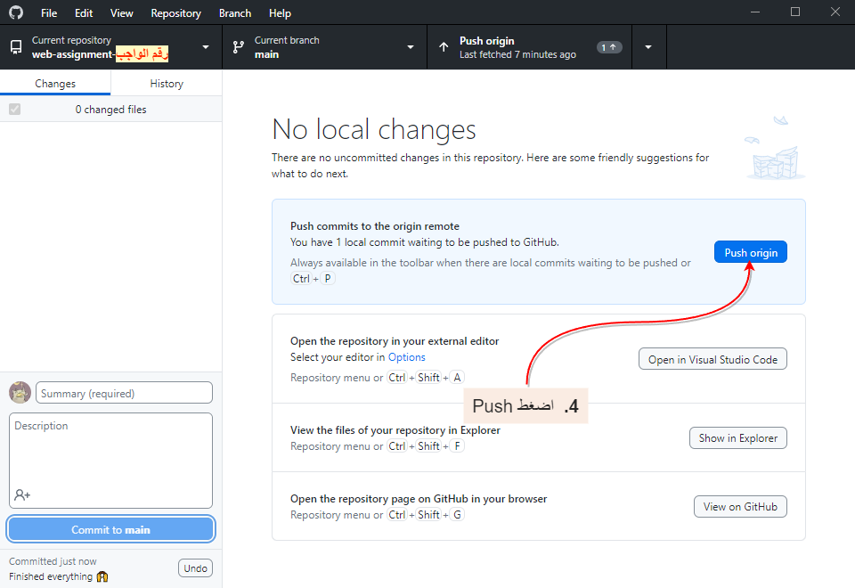

# 👋 Welcome to MSC's Web Development Track !!

Today's task is simple. You will find a text file by the name **introduction.txt**. Open it and make the approperiate edits, then save it.

```
Hi!

My name is ...                    <---  Add your name here
My university id number is ...    <---  Add your id here
```

The file should look similar to this example:

```
Hi!

My name is Kareem Ahmed Mohammed.
My university id number is 2051710001.
```


## Uploading Assignments to GitHub

**Step 1:** Select the repository. Assignment repositories begin with "web-assignment". For example, assignment 1 will have the name "web-assignment-1".



**Step 2:** Write a commit summary. A commit summary is just a short description of the work you've done so far. If you're finished with the assignment, write "finished" in the summary.



**Step 3:** Click "Commit" to save your changes. This will **NOT** upload your changes to GitHub.



**Step 4:** Click "Push origin" to upload all your commits to GitHub. At this point, all your changes so far are visible to us.



<br><br>

# 👋 أهلا بيكم في تراك تطوير الويب !!

تاسك النهاردة بسيط جداً. عايزين منكم بس تفتحوا ملف اسمه introduction.txt وتعدلوا عليه. افتحوا الملف واكتبوا فيه اسمكم ورقم ال id واحفظوا الملف.

```
Hi!

My name is ...                    <---  اسمكم هنا
My university id number is ...    <---  هنا id ال
```

الملف بعد التعديل المفروض يبقى شبه ده:

```
Hi!

My name is Kareem Ahmed Mohammed.
My university id number is 2051710001.
```

## رفع الواجب ل GitHub

### الخطوة الأولى

اختار ال repository (مخزن بالعربي). اسماء مخازن الواجبات بتبتدي بـ `web-assignment` . مثلا الواجب الأول هيكون اسمه `web-assignment-1` .




### الخطوة الثانية

كتابة ملخص للـ commit وهو عبارة عن وصف بسيط للتغييرات. لو التغيير ده هو آخر تعديل ليكم اكتبوا هنا Finished عشان نعرف انكم خلصتوا الواجب.




### الخطوة الثالثة

الضغط على Commit لحفظ التغييرات.
**ملحوظة مهمة:** لحد دلوقتي التغييرات مترفعتش على GitHub . هدف commit هو أخد صورة للمخزن في لحظة معينة مش رفع التعديل.




### الخطوة الرابعة

الضغط على Push origin لرفع كل التغييرات لـ GitHub .
بعد الخطوة دي هنقدر نشوف تعديلاتك ونساعدك في حل مشاكل الكود بتاعك 😊




